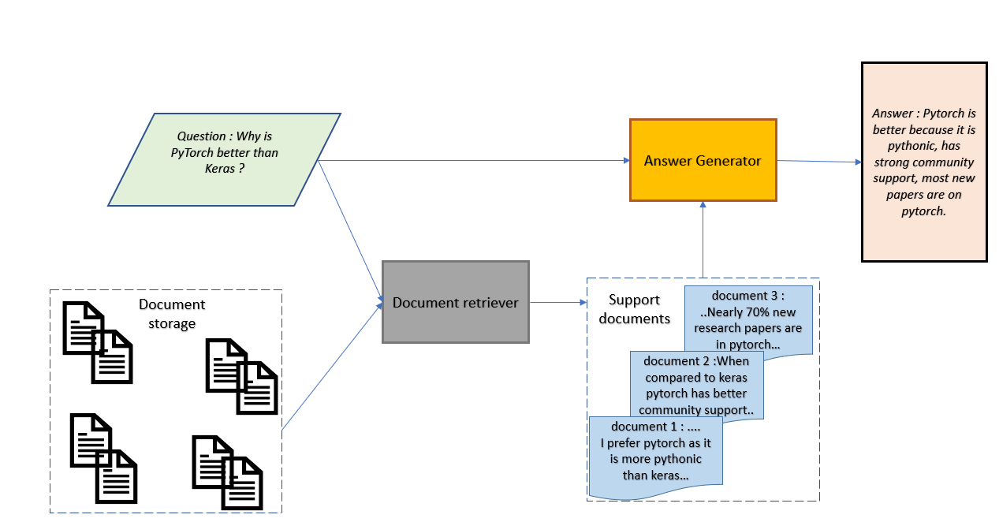
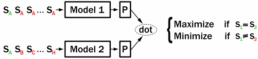
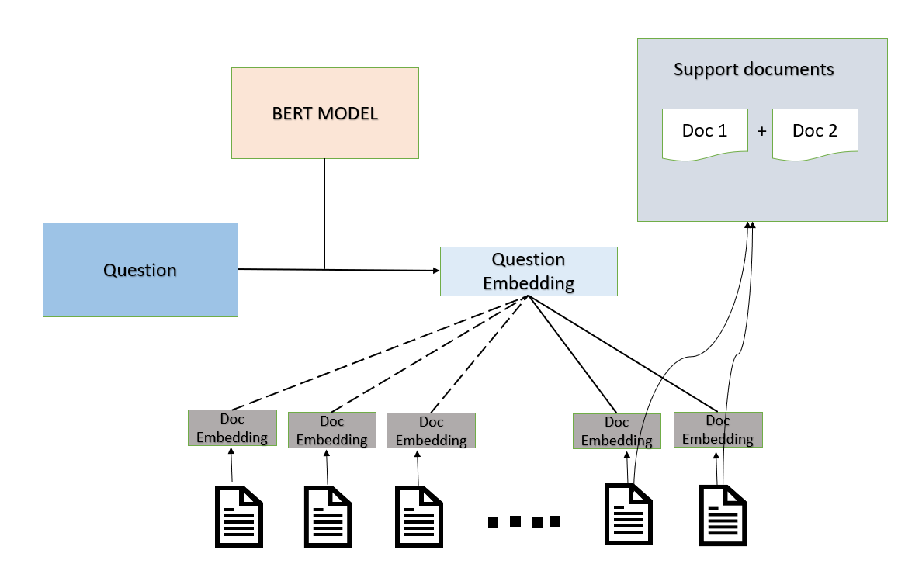
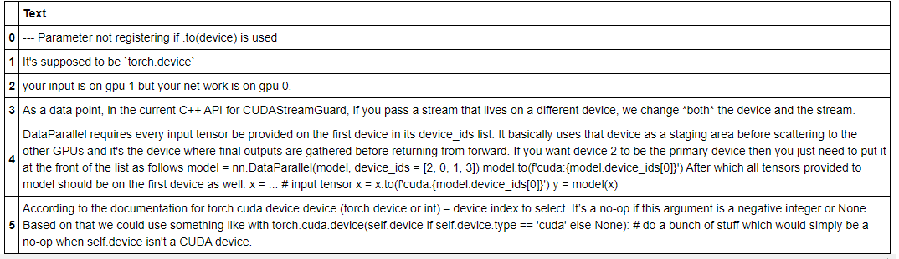
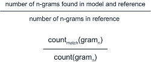
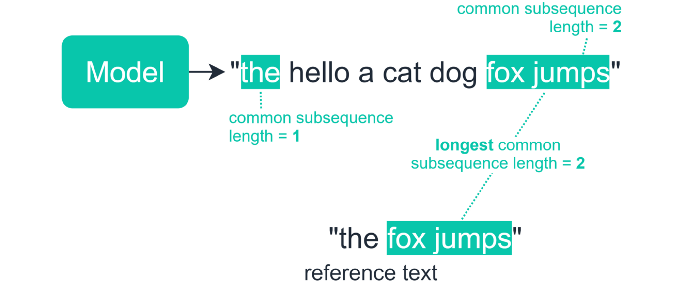

# Question Answering System

by Krishna N Revi 

## 1. Introduction

Industries are increasingly turning to automated chat assistants to handle customer support interactions. But, these tools can only successfully answer questions they were trained on, exposing a growing challenge for enterprise question answering (QA) techniques today. To address this, we are trying to build an intelligent question answering system that doesn’t just return documents related to the question, but extracts relevant information within the documents and puts forth the detailed answer, like one that a human would have come up with. 

In this notebook, we implement a domain-specific question-answering engine that answers any questions related to PyTorch. This model benefits students and working professionals who are beginners in PyTorch. The model is developed with datasets collected from Stack Overflow, PyTorch Github issues, PyTorch documentation, PyTorch discussion forum, and Youtube videos.

## 2. Data Collection Strategies

As mentioned in the introduction, data is collected from the following five resources.

1. StackOverFlow: Using [StackOverflow - Stack Exchange API](https://api.stackexchange.com/docs), downloaded all the questions that are answered about PyTorch 
2. PyTorch Discuss: Parsed the data manually using automated Python-based website crawlers
3. PyTorch Documentation: Downloaded the PyTorch Documentation and converted the documentation into simple question answers
4. PyTorch's GitHub: Downloaded all the closed issues from the GitHub repo of PyTorch related projects
5. PyTorch Youtube: Download the subtitles for the YouTube videos discussing PyTorch Interview questions using [youtube-transcript-API](https://github.com/jdepoix/youtube-transcript-api)


## 3. Data Set Preparation 

One of the major tasks after collecting data is to clean the datasets and bring all five sets into a common json format.

An example from the final question-answer pair training data set looks like follows :

- Example :

- - *x: Question: Why is PyTorch better than Keras?*
  - *z: Answer Document: In my opinion, this is a very personal question. Every developer/person would have his/her comfort level while deciding on which platform suits them. I will share my opinion. I think PyTorch is better because it is pythonic, (literally like python and you do not need to learn anything new), has higher performance, strong community support, most new papers are written using PyTorch, and has dynamic computation graphs. But again, I might be biased towards it, and maybe you may like something that is better in Keras than Pytorch and might decide to go ahead with it.*
  - *y: Exact Answer: PyTorch is better because it is pythonic, has higher performance,* has*strong community support, most new papers are written using PyTorch, and has dynamic computation graphs.*

We will save all the supporting documents (answer documents) from train and test sets separately in another json for the ease of training. It's because one question might have been addressed in other supporting documents as well (other than the oblivious answer document ). Saving all supporting documents separately benefits us to take advantage of all relevant documents to answer that particular question (We'll see how this works in the following sections).

We have 9140 question-answer pairs in the train set, 2286 in the test set, and a total of 11426 supporting documents.

Refer to code for data pre-processing 👉 [here](https://github.com/krishnarevi94/Capstone/blob/main/data_processing.py)

## 4. Model Overview

Imagine that you are in a hurry to understand *"how a particular operation is being performed in PyTorch"*, or want to know "*how to resolve a repetitive error*", how would you go about finding that information? You'll probably search google for answers.

If your query has already been asked and answered clearly on one of the many technical question answering platforms available on the Internet (such as StackOverflow, Github, PyTorch discussion forums, or Pytorch documentation ), then you're in luck, modern search engines will probably take you to that pre-existing answer pretty reliably in a matter of a few clicks.

If no one else has asked the exact question you are interested in, then the process will be a little more involved. You will likely have to collect relevant information from a variety of sources, figure out how these pieces of knowledge fit together concerning your query, and synthesize a narrative that answers your initial question.

Now, wouldn't it be great if your model could do all of that for you: gather the right sources - paragraphs from relevant source pages like StackOverflow, Github, PyTorch discussion forums, or Pytorch documentation, synthesize the information, and write up an easy-to-read, original summary of the relevant points? Such a system isn't quite available yet, at least not one that can provide *reliable* information in its summary. 

Thankfully, many recent advances in natural language understanding and generation have made working toward solving this problem much easier! These advances include progress in the pre-training (e.g. [BART](https://arxiv.org/abs/1910.13461), [T5](https://arxiv.org/abs/1910.10683)) and evaluation (e.g. for [factuality](https://arxiv.org/abs/2004.04228)) of sequence-to-sequence models for conditional text generation, new ways to use language understanding models to find information in Wikipedia (e.g. [REALM](https://kentonl.com/pub/gltpc.2020.pdf), [DPR](https://arxiv.org/abs/2004.04906))

Recently released models have been shown to include a significant amount of world knowledge in their parameters without the need for any external knowledge at all (see e.g. the [Closed-book QA performance of the T5 model](https://arxiv.org/abs/2002.08910)). There are several advantages to giving the model explicit access to information in text form, however. First, a larger number of parameters in a model implies a larger computational cost. Secondly, getting information from a text database allows us to easily update the model's knowledge without having to re-train its parameters.

Our question answering system has two major components. One document retriever and one answer generator. First, the Document Retriever selects a set of documents from the document corpus that have information relevant to the question. Then, the Answer Generation Model reads the concatenation of the question and retrieved passages, and writes out the answer.



## 5. Model Architecture Explained 

### 5.1 Retriever

Before generating answers for the given query, our QA system needs to find supporting documents. The Retriever module’s job is to find the best candidate documents by calculating the similarity between query and document vectors. We can use either a sparse retriever or a dense retriever to automatically find relevant document snippets for a question.

The sparse retriever works by finding passages that feature the words from the query. However, it has no way to know *a priori* which of these words are more important in context and seems to struggle with understanding the central theme of the query.

Thankfully, some recent works have taken advantage of advances in pre-trained contextual word representations to solve this problem. Models such as [DPR](https://arxiv.org/abs/2004.04906) or [REALM](https://arxiv.org/abs/2002.08909) for example learn to compute a vector representation of the query, as well as vector representations of passages in such a way that the passages that best answer a question maximize the dot product between the two representations. Retrieval is then reduced to a Maximum Inner Product Search, which can be executed efficiently using systems like [FAISS](https://github.com/facebookresearch/faiss).

These successes are very encouraging for our Open-Domain QA application. However, our setup does not quite meet the requirements of either of these approaches. On the one hand, the [DPR](https://arxiv.org/abs/2004.04906) system is trained using gold passage annotations. Unfortunately, we do not have such annotations for our data set. On the other hand, while [REALM](https://arxiv.org/abs/2002.08909) is trained without passage supervision, it requires a pretty expensive pre-training step with an [Inverse Cloze Task](https://arxiv.org/abs/1906.00300) (100,000 steps with batch size 4096), and the ability to re-compute the embeddings of all passages regularly during training.

To train a similar dense retrieval system at reduced cost without having access to gold passage annotation, we will have to **take advantage of another unique feature of our dataset**, **namely the fact that our answers are quite similar in style to the document snippets we want to index. Our answers are summarized, cleaned versions of corresponding document snippets.** Our hypothesis then is that if we train a system to embed the questions and answers in our dataset in a way that allows us to easily match questions to answers, then using the answer embedder on document snippets should allow us to similarly match questions to supporting evidence from document corpus.

This module is divided into the following three sub-modules :

1. Contrastive Training with In-Batch Negatives
2. Using the Trained Dense Retriever and Document Index
3. Using the Trained Dense Retriever and Document Index

#### 5.1.1 Contrastive Training with In-Batch Negatives

As mentioned above, we want to train a system to produce question and answer embeddings, such that the dot product between the representation of a question and its answer is greater than between it and answers of all of the other questions in the dataset.

Unfortunately, comparing all questions to all answers before taking every single gradient step is computationally prohibitive. instead, we simply process medium to large batches of question-answer pairs and make sure that the dot product of a question with its answer is larger than with all other answers in the batch, and *vice versa*.

Following is a representation of contrastive training taken from [website](https://www.sbert.net/examples/unsupervised_learning/CT_In-Batch_Negatives/README.html) 



We utilize  cross-entropy loss for the multinomial distribution over all of the answers (or questions) in a batch, and make use of [PyTorch gradient checkpointing](https://pytorch.org/docs/stable/checkpoint.html) to be able to use large batches with limited GPU memory. Checkpointing works by trading compute for memory. Rather than storing all intermediate activations of the entire computation graph for computing backward, the checkpointed part does not save intermediate activations and instead recomputes them in the backward pass. It can be applied to any part of a model.

To train the retriever, we show the model batches of 512 question-answer pairs. The model needs to ensure that the embedding of each question in the batch is closer to the embedding of its corresponding answer than to the embedding of any other answer in the batch.

We use a single BERT-style pre-trained model to embed the questions and answers and learn different projection matrices to bring both representations down to dimension 128. We use the 8-layer distilled version of BERT from the [Well-Read Students Learn Better paper](https://arxiv.org/abs/1908.08962) for training.

Once the model is trained, we use the model to compute passage embeddings for all documents in the corpus.

#### 5.1.2 Using the Trained Dense Retriever and Document Index

Now that we have trained our model to compute query and answer embeddings and used it to compute passage embeddings for all our document snippets in the corpus, let's see whether it can find supporting evidence for a new question. At test time, the dense retriever model encodes the question and compares its embedding to the pre-computed representation of all the document snippets in the corpus by doing Max Inner Product Search. The ten passages with the closest embedding are returned to create the support document. 



The MIPS part can be executed efficiently with the faiss library. Additionally, since we computed 128-dimensional passage embeddings, the whole of the representations fits on a GPU, making retrieval even faster. 

Let's have a look at what's FAISS and how FAISS Makes Search Efficient.

##### Facebook AI Similarity Search (FAISS)

Faiss is a library for efficient similarity search and clustering of dense vectors. It contains algorithms that search in sets of vectors of any size, up to ones that possibly do not fit in RAM. It also contains supporting code for evaluation and parameter tuning. Faiss is written in C++ with complete wrappers for Python/NumPy. 

FAISS uses all of the intelligent ANN graph-building logic to be more efficient. The first of those efficiency savings of FAISS comes from efficient usage of the GPU, so the search can process calculations in parallel rather than in series — offering a big speed-up.

Additionally, FAISS implements three additional steps in the indexing process. A preprocessing step, followed by two quantization operations — the *coarse* quantizer for inverted file indexing (IVF), and the *fine* quantizer for vector encoding.

###### **Preprocessing**

We enter this process with the vectors that we would like FAISS to index. The very first step is to transform these vectors into a more friendly/efficient format. FAISS offers several options here.

- PCA — use principal component analysis to reduce the number of dimensions in our vectors.
- L2norm — L2-normalize our vectors.
- OPQ — rotates our vectors so they can be encoded more efficiently by the *fine* quantizer — if using product quantization (PQ).
- Pad—pads input vectors with zeros up to a given target dimension.

This operation means that when we do get around to comparing our query vector against already embedded vectors, each comparison will require less computation — making things faster.

###### **Inverted File Indexing**

The next step is our inverted file (IVF) indexing process. Again, there are multiple options — but each one is aiming to partition data into *similar* clusters.

This means that when we query FAISS, and our query is converted into a vector — it will be compared against these partition/cluster centroids.

We compare similarity metrics against our query vector and each of these centroids — and once we find the nearest centroid, we then access all of the full vectors within that centroid (and ignore all others).

Immediately, we have significantly reduced the required search area — reducing complexity and speeding up the search.

###### **Vector Encoding**

The final step is a final encoding step for each vector before it is indexed. This encoding process is carried out by our *fine* quantizer. The goal here is to reduce index memory size and increase search speed.

There are several options:

- Flat — Vectors are stored as is, without any encoding.
- PQ — Applies  product quantization 
- SQ — Applies scalar quantization

It’s worth noting that even with the *Flat* encoding, FAISS is still going to be very fast.

All of these steps and improvements combine to create an incredibly fast similarity search engine — which on GPU is still unbeaten.

Let's see how faiss do document search for a sample question from the test set 



As we can see ,the retrieved documents have a greater focus on the context of the question, which is exactly what information model needs to answer this question.

#### 5.1.3 Retriever Model Evaluation

We have trained a retrieval model that *seems* to be working fine, at least on our running example. Before we use it to answer questions, however, we would like to be able to get some quantitative evaluation of the performance of our dense retriever model.

For the retriever, we want to favor recall over precision as our priority is to make sure that all of the information needed to write the answers is present in the support document. If there is unrelated information, the generation model can learn to sort it out. We measure this by computing the proportion of words in the high-scoring answers which are present in the retrieved support document. To focus on important words, we also weigh answer words by their *Inverse Document Frequency*. This gives us the  IDF-recall scoring function.

Next, we can  use our dense retriever model for training of sequence-to-sequence answer generation system.

## 6. Generator

Now let's look into training the second component of our system: the **answer generation module**. We will instantiate it as a sequence-to-sequence model which uses the [BART](https://arxiv.org/abs/1910.13461) architecture, and initialize it with the [bart-large pre-trained weights](https://huggingface.co/facebook/bart-large).

We provide the concatenation of the question and support document as input to the model and train the decoder to minimize the perplexity of the answer. The supporting passages are separated by a special token <P>, so the input for our running example will look like:

*question: Parameter not registering if .to(device) is used document: <P> It's supposed to be torch.device <P> According to the documentation for the torch.Cuda.device device (torch.device or int) – device index to select. It’s a no-op if this argument is a negative integer or None. Based on that we could use something like with torch.cuda.device(self.device if self.device.type == 'cuda' else None): # do a bunch of stuff which would simply be a no-op when self.device isn't a CUDA device.*

The first thing we do is pre-compute the support documents for the training and validation sets. The output of the model is our generated answer. 

#### Generator model evaluation 

The last thing we'll do is see how we can get a quantitative evaluation of the model performance. Here, we'll use the ROUGE implementation provided in the nlp library.

Let's see what Rouge means :

##### Recall-Oriented Understudy for Gisting Evaluation (ROUGE)

ROUGE is a set of metrics, rather than just one used to measure the accuracy of a language-based sequence when dealing with language summarization or translation.

###### ROUGE-N

ROUGE-N measures the number of matching ‘n-grams’ between our model-generated text and a ‘reference’.With ROUGE-N, the N represents the n-gram that we are using. For ROUGE-1 we would be measuring the match rate of unigrams between our model output and reference.

ROUGE-2 and ROUGE-3 would use bigrams and trigrams respectively. Once we have decided which N to use — we now decide on whether we’d like to calculate the ROUGE recall, precision, or F1 score.

###### Recall

The recall counts the number of overlapping n-grams found in both the model output and reference — then divides this number by the total number of n-grams in the reference. It looks like this:



###### Precision

The precision metric is calculated in almost the same way, but rather than dividing by the reference n-gram count, we divide by the model n-gram count.


###### F1-Score

Now that we both the recall and precision values, we can use them to calculate our ROUGE F1 score like so:


###### ROUGE-L

ROUGE-L measures the longest common subsequence (LCS) between our model output and reference. All this means is that we count the longest sequence of tokens that is shared between both:



The idea here is that a longer shared sequence would indicate more similarity between the two sequences.

## 7. Evaluation of models 

### 7.1 Retriever

#### 7.1.1 Training Logs

Let's look at the training logs of our fine tuned BERT model

We can see our training and evaluation loss values are decreasing over time ,which means our model is learning and given more compute and memory we can build a very good retriever system . 

```
0     0 of    17 	 L: 6.387 	 -- 10.484
 0     1 of    17 	 L: 6.375 	 -- 20.875
Saving model retriever_model_l-8_h-768_b-512-512
Evaluation loss epoch    0: 5.888
 1     0 of    17 	 L: 5.996 	 -- 10.389
 1     1 of    17 	 L: 5.982 	 -- 20.901
Saving model retriever_model_l-8_h-768_b-512-512
Evaluation loss epoch    1: 5.510
 2     0 of    17 	 L: 5.566 	 -- 10.400
 2     1 of    17 	 L: 5.530 	 -- 20.779
Saving model retriever_model_l-8_h-768_b-512-512
Evaluation loss epoch    2: 5.087
 3     0 of    17 	 L: 5.060 	 -- 10.392
 3     1 of    17 	 L: 5.112 	 -- 20.781
Saving model retriever_model_l-8_h-768_b-512-512
Evaluation loss epoch    3: 4.851
 4     0 of    17 	 L: 4.527 	 -- 10.381
 4     1 of    17 	 L: 4.361 	 -- 20.765
Saving model retriever_model_l-8_h-768_b-512-512
Evaluation loss epoch    4: 4.590
 5     0 of    17 	 L: 3.759 	 -- 10.395
 5     1 of    17 	 L: 3.641 	 -- 20.770
Saving model retriever_model_l-8_h-768_b-512-512
```

#### 7.1.2 Quantitative Evaluation Metrics

As discussed in modeling part we perform quantitative evaluation of the performance of our dense retriever model using IDF-Recall scoring .

| IDF-Recall | Time/Query |
| ---------- | ---------- |
| 0.2540     | 0.0093     |

We got an IDF-Recall of 0.2540 which is not that bad. But this metric has limitations. Since it only looks at individual word matches, it is oblivious to word order or paraphrases among others.  

### 7.2 Generator

#### 7.2.1 Training Logs

Let's look at the last few training logs of our seq2seq model.

We can see our training and evaluation loss values are decreasing over time ,which means our model is learning and given more compute and memory we can build a very good generator model .

```
Total 	 L: 3.204 	 -- 129.316
 3     0 of  4570 	 L: 1.964 	 -- 0.385
 3     1 of  4570 	 L: 1.229 	 -- 0.706
 3   100 of  4570 	 L: 1.544 	 -- 33.171
 3   200 of  4570 	 L: 1.568 	 -- 65.925
 3   300 of  4570 	 L: 1.464 	 -- 98.587
 3   400 of  4570 	 L: 1.770 	 -- 131.394
 3   500 of  4570 	 L: 1.706 	 -- 163.685
 3   600 of  4570 	 L: 1.558 	 -- 196.125
 3   700 of  4570 	 L: 1.566 	 -- 228.094
 3   800 of  4570 	 L: 1.462 	 -- 259.906
 3   900 of  4570 	 L: 1.585 	 -- 291.662
 3  1000 of  4570 	 L: 1.524 	 -- 323.385
 3  1100 of  4570 	 L: 1.822 	 -- 355.877
 3  1200 of  4570 	 L: 1.655 	 -- 388.583
 3  1300 of  4570 	 L: 1.379 	 -- 421.237
 3  1400 of  4570 	 L: 1.411 	 -- 453.985
 3  1500 of  4570 	 L: 1.502 	 -- 486.715
 3  1600 of  4570 	 L: 1.467 	 -- 519.326
 3  1700 of  4570 	 L: 1.586 	 -- 552.068
 3  1800 of  4570 	 L: 1.608 	 -- 584.858
 3  1900 of  4570 	 L: 1.559 	 -- 617.540
 3  2000 of  4570 	 L: 1.342 	 -- 650.303
 3  2100 of  4570 	 L: 1.497 	 -- 682.981
 3  2200 of  4570 	 L: 1.496 	 -- 715.691
 3  2300 of  4570 	 L: 1.614 	 -- 748.429
 3  2400 of  4570 	 L: 1.504 	 -- 781.188
 3  2500 of  4570 	 L: 1.578 	 -- 813.972
 3  2600 of  4570 	 L: 1.595 	 -- 846.287
 3  2700 of  4570 	 L: 1.483 	 -- 878.025
 3  2800 of  4570 	 L: 1.328 	 -- 910.606
 3  2900 of  4570 	 L: 1.552 	 -- 943.340
 3  3000 of  4570 	 L: 1.487 	 -- 976.101
 3  3100 of  4570 	 L: 1.286 	 -- 1008.869
 3  3200 of  4570 	 L: 1.681 	 -- 1041.667
 3  3300 of  4570 	 L: 1.261 	 -- 1074.263
 3  3400 of  4570 	 L: 1.316 	 -- 1106.990
 3  3500 of  4570 	 L: 1.715 	 -- 1139.765
 3  3600 of  4570 	 L: 1.362 	 -- 1172.603
 3  3700 of  4570 	 L: 1.638 	 -- 1205.316
 3  3800 of  4570 	 L: 1.518 	 -- 1238.036
 3  3900 of  4570 	 L: 1.395 	 -- 1270.781
 3  4000 of  4570 	 L: 1.583 	 -- 1303.586
 3  4100 of  4570 	 L: 1.432 	 -- 1335.833
 3  4200 of  4570 	 L: 1.452 	 -- 1367.757
 3  4300 of  4570 	 L: 1.429 	 -- 1399.563
 3  4400 of  4570 	 L: 1.392 	 -- 1432.249
 3  4500 of  4570 	 L: 1.441 	 -- 1464.018
Saving model s2s_bart_model
    0 of  1143 	 L: 2.877 	 -- 0.117
  100 of  1143 	 L: 3.147 	 -- 11.194
  200 of  1143 	 L: 3.227 	 -- 21.827
  300 of  1143 	 L: 3.317 	 -- 32.506
  400 of  1143 	 L: 3.292 	 -- 43.155
  500 of  1143 	 L: 3.259 	 -- 54.198
  600 of  1143 	 L: 3.288 	 -- 64.865
  700 of  1143 	 L: 3.287 	 -- 76.073
  800 of  1143 	 L: 3.283 	 -- 87.162
  900 of  1143 	 L: 3.292 	 -- 97.794
 1000 of  1143 	 L: 3.308 	 -- 108.599
 1100 of  1143 	 L: 3.313 	 -- 119.270
Total 	 L: 3.309 	 -- 123.766
 4     0 of  4570 	 L: 1.920 	 -- 0.384
 4     1 of  4570 	 L: 0.060 	 -- 0.704
 4   100 of  4570 	 L: 1.362 	 -- 32.510
 4   200 of  4570 	 L: 1.387 	 -- 64.213
 4   300 of  4570 	 L: 1.259 	 -- 96.502
 4   400 of  4570 	 L: 1.521 	 -- 128.323
 4   500 of  4570 	 L: 1.505 	 -- 160.672
 4   600 of  4570 	 L: 1.302 	 -- 192.499
 4   700 of  4570 	 L: 1.358 	 -- 224.824
 4   800 of  4570 	 L: 1.291 	 -- 257.216
 4   900 of  4570 	 L: 1.356 	 -- 288.991
 4  1000 of  4570 	 L: 1.321 	 -- 321.114
 4  1100 of  4570 	 L: 1.615 	 -- 353.115
 4  1200 of  4570 	 L: 1.432 	 -- 384.926
 4  1300 of  4570 	 L: 1.196 	 -- 416.655
 4  1400 of  4570 	 L: 1.226 	 -- 448.967
 4  1500 of  4570 	 L: 1.312 	 -- 481.837
 4  1600 of  4570 	 L: 1.261 	 -- 514.653
 4  1700 of  4570 	 L: 1.378 	 -- 547.460
 4  1800 of  4570 	 L: 1.359 	 -- 580.305
 4  1900 of  4570 	 L: 1.329 	 -- 613.032
 4  2000 of  4570 	 L: 1.170 	 -- 645.829
 4  2100 of  4570 	 L: 1.275 	 -- 677.871
 4  2200 of  4570 	 L: 1.299 	 -- 710.623
 4  2300 of  4570 	 L: 1.369 	 -- 743.398
 4  2400 of  4570 	 L: 1.290 	 -- 776.202
 4  2500 of  4570 	 L: 1.429 	 -- 809.049
 4  2600 of  4570 	 L: 1.363 	 -- 841.813
 4  2700 of  4570 	 L: 1.274 	 -- 874.521
 4  2800 of  4570 	 L: 1.140 	 -- 907.376
 4  2900 of  4570 	 L: 1.342 	 -- 940.137
 4  3000 of  4570 	 L: 1.298 	 -- 972.776
 4  3100 of  4570 	 L: 1.108 	 -- 1004.718
 4  3200 of  4570 	 L: 1.421 	 -- 1036.573
 4  3300 of  4570 	 L: 1.078 	 -- 1068.419
 4  3400 of  4570 	 L: 1.162 	 -- 1100.217
 4  3500 of  4570 	 L: 1.532 	 -- 1132.071
 4  3600 of  4570 	 L: 1.170 	 -- 1163.972
 4  3700 of  4570 	 L: 1.399 	 -- 1195.770
 4  3800 of  4570 	 L: 1.322 	 -- 1227.651
 4  3900 of  4570 	 L: 1.243 	 -- 1259.443
 4  4000 of  4570 	 L: 1.290 	 -- 1291.613
 4  4100 of  4570 	 L: 1.195 	 -- 1323.642
 4  4200 of  4570 	 L: 1.252 	 -- 1355.387
 4  4300 of  4570 	 L: 1.236 	 -- 1387.205
 4  4400 of  4570 	 L: 1.205 	 -- 1419.961
 4  4500 of  4570 	 L: 1.212 	 -- 1452.031
Saving model s2s_bart_model
    0 of  1143 	 L: 3.008 	 -- 0.118
  100 of  1143 	 L: 3.191 	 -- 11.627
  200 of  1143 	 L: 3.271 	 -- 22.308
  300 of  1143 	 L: 3.361 	 -- 33.010
  400 of  1143 	 L: 3.341 	 -- 43.705
  500 of  1143 	 L: 3.308 	 -- 54.351
  600 of  1143 	 L: 3.339 	 -- 65.041
  700 of  1143 	 L: 3.340 	 -- 76.472
  800 of  1143 	 L: 3.339 	 -- 88.204
  900 of  1143 	 L: 3.352 	 -- 99.858
 1000 of  1143 	 L: 3.362 	 -- 111.506
 1100 of  1143 	 L: 3.370 	 -- 123.214
Total 	 L: 3.366 	 -- 128.126
```

#### 7.2.2 Quantitative Evaluation Metrics

Here is the rouge metrics for quantitative evaluation of the generator model :

|      | rouge1 | rouge2 | rougeL |
| ---- | ------ | ------ | ------ |
| P    | 0.1382 | 0.0231 | 0.0868 |
| R    | 0.2680 | 0.0591 | 0.2083 |
| F    | 0.1313 | 0.0226 | 0.0864 |

## 8. Predictions 

Following are some sample predictions made by our model . Predictions for 100 questions from our test set is available [here](https://github.com/krishnarevi94/Capstone/blob/main/result_100_test_questions.xlsx) .

| Question                                                     | Predicted Answer                                             | Actual answer                                                |
| ------------------------------------------------------------ | ------------------------------------------------------------ | ------------------------------------------------------------ |
| does  pytorch has geometric deep learning support?           | PyTorch Geometric (PyG) is a  geometric deep learning extension library for PyTorch.It consists of various  methods for deep learning on graphs and other irregular structures, also  known as Geometric Deep Learning, from a variety of published papers. In addition,  it consists of an easy-to-use mini-batch loader for many small and single  giant graphs, multi GPU-support, a large number of common benchmark datasets  (based on simple interfaces to create your own), and helpful transforms, both  for learning on arbitrary graphs as well as on 3D clouds. | PyTorch Geometric (PyG) is a  geometric deep learning extension library for PyTorch.It consists of various  methods for deep learning on graphs and other irregular structures, also  known as geometric deep learning, from a variety of published papers |
| In  Pytorch, quantity.backward() computes the gradient of quantity wrt which of  the parameters? | The argument grad_output is the  gradient with respect to the output given by the autograd engine. grad_input  is the tensor where the output is the sum of the gradients in each of its  uses. In other words, if your matrix element x has positive gradient when  first applied and negative when used the second time, it may be that the net  effects will cancel out and it will stay as it is (or change just a bit). If  both applications call for x to be higher, it will raise more than if it was  used just once, etc. | Computing quantity requires  constructing a 2-sorted graph with nodes being either tensors or  differentiable operations on tensors (a so-called computational graph). Under  the hood, pytorch keeps track of this graph for you. When you call  quantity.backward(), you're asking pytorch to perform an inverse traversal of  the graph, from the output to the inputs, using the derivative of each  operation encountered rather the operation itself. Leaf tensors that are  flagged as requiring gradients accumulate the gradients computed by backward.  An optimizer is a different story: it simply implements an optimization  strategy on a set of parameters, hence it needs to know which parameters you  want it to be optimizing. So quantity.backward() computes gradients, optim.step()  uses these gradients to perform on a optimization step, updating the  parameters contained in model. As for efficiency, I don't see any argument in  favor of specifying parameters in the backward pass (what would the semantics  of that be?). If what you'd want is to avoid traversal of parts of the graph  in backward mode, pytorch will do it automagically for you if you remember: *  you can mark leaf tensors as not requiring grad * a non-leaf tensor -- the  output of some operation f(x1,...xN) -- requires grad if at least one of  x1...xN requires grad * a tensor that doesn't require grad blocks backward  traversal, ensuring no unnecessary computation |
| What  does the stashing logic save and restore for the current device? | the stashing logic save and  restore for the current device. This means that if your model is dynamic,  e.g., changes behavior depending on input data, the export won’t be accurate.  Similarly, a trace is likely to be valid only for a specific input size (which  is one reason why we require explicit inputs on tracing.) | the RNG state                                                |
| PRelue  is not supperted with mmdnn?                         | Yes MMDNN Support supports  LeakyRelu. Check the link below for pytorch_emitter.py implementation from  MMdNN. PyTorch_EMITTER.py If you check the implementation you will find all  the supported operations and it doesn't include PRELU. | Yes MMDNN Support supports  LeakyRelu. Check the link below for pytorch_emitter.py implementation from  MMdNN. PyTorch_EMITTER.py If you check the implementation you will find all  the supported operations and it doesn't include PRELU. |
| How can  I assign a list to a torch.tensor?                  | You can directly convert python  list to a pytorch Tensor by defining the dtype. For example, import torch  a_list = [3,23,53,32,53] A_Tensor = torch.Tensor(A_LIST)  print(a_tensor.int()) Here is the documentation: You can use x.item() to get  a Python number from a tensor that has one element. | use torch.Tensor(list).                                      |

Some of these answers make sense! The model seems to sometimes struggle with starting some of the answers,this mainly seems like an issue with data . Some of the data we trained with isn't cleaned properly. but we're getting some  good information overall. At least we got a good model ready with which we can retrain any other domain data( properly cleaned one!!) with minimal rework .

## 9. Challenges 

- Data : Data has been most challenging part of this problem . 

  - Retrieved data had good amount of urls , name of authors , tags ,tables etc cleaning this was most tedious task
  - Data cleaning is provided in the data_processing.py file
  - After all cleaning we had only 11426  question answer pairs . In that 80 %  was used for training .

- Computation time : In generator each epoch takes around 1 hour to complete in a single GPU . 
- Memory issue  : Had to compromise batch size , max length of documents , questions and answers for the sake of memory . Instead of considering entire "z" document if we  had made each documents into smaller documents each of length 100 or 200 our model could have performed better  .

## 10. References

1. [Long-Form Question Answering](https://research.fb.com/wp-content/uploads/2019/07/ELI5-Long-Form-Question-Answering.pdf)
2. [DPR](https://github.com/facebookresearch/DPR)
3. [RAG](https://arxiv.org/pdf/2005.11401v4.pdf)
4. [ROUGE](https://towardsdatascience.com/the-ultimate-performance-metric-in-nlp-111df6c64460FAISS)
5. [FAISS](https://github.com/facebookresearch/faiss/)

Refer to the complete solution 👉 [here](https://github.com/krishnarevi94/Capstone/blob/main/Question_answer_system.ipynb)
